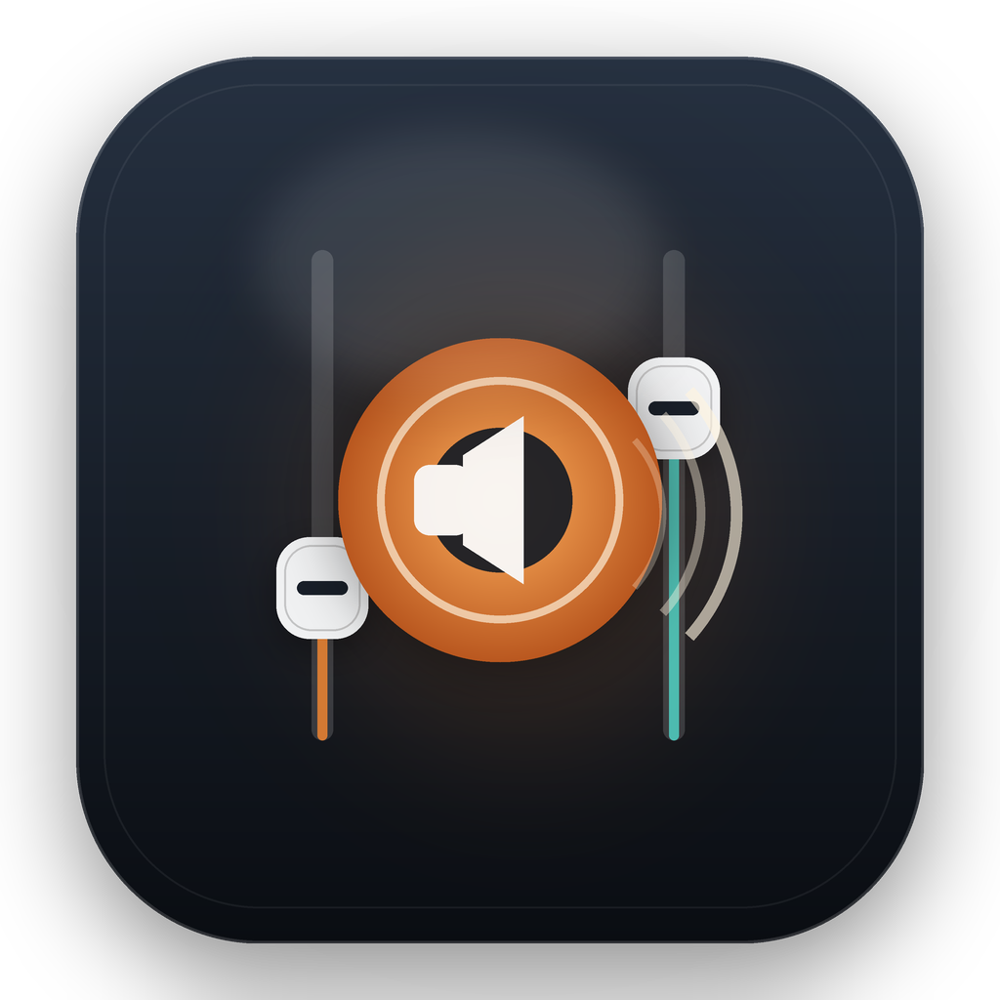
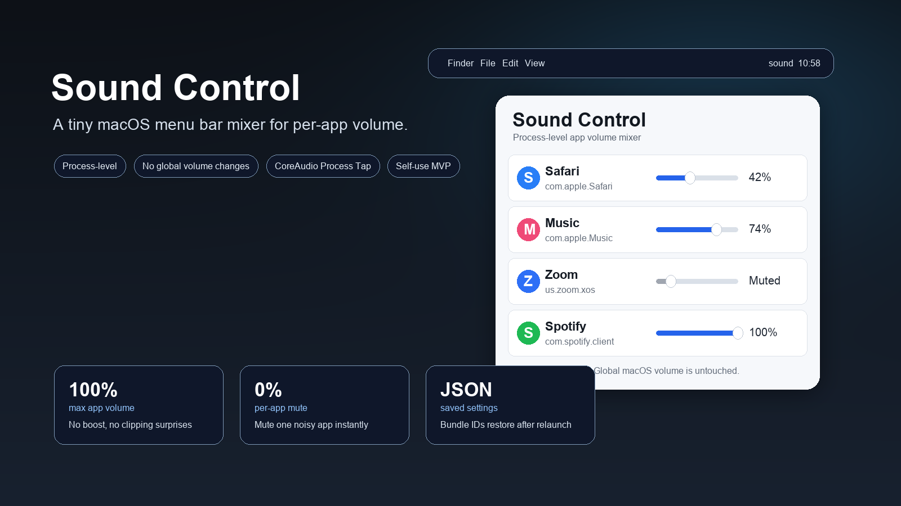
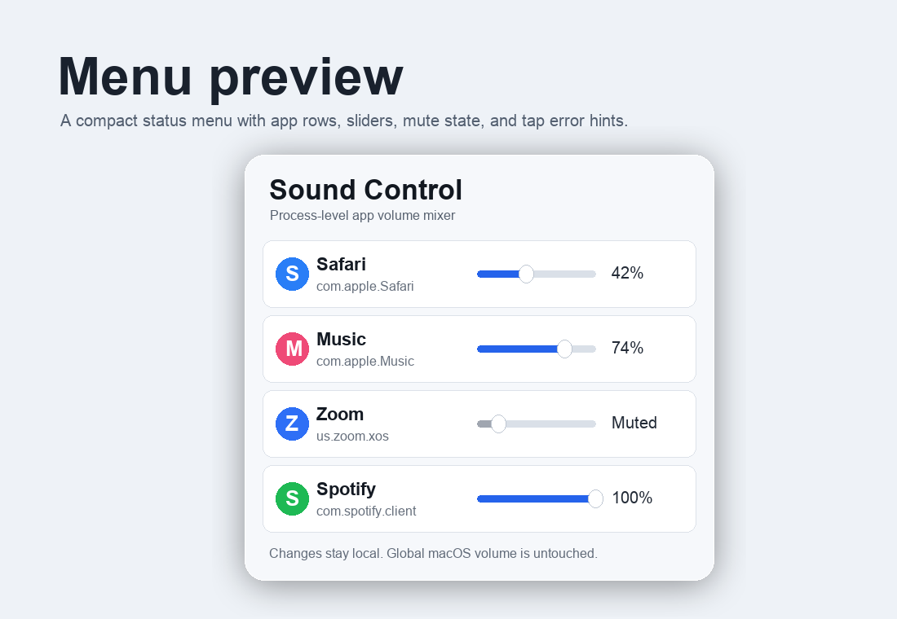
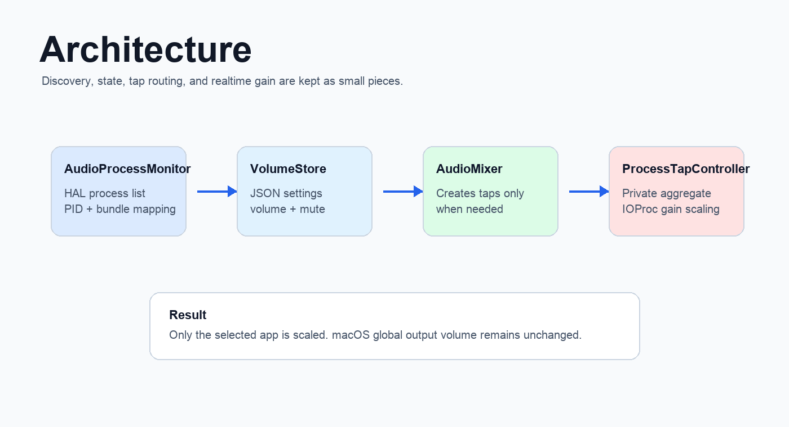

# Sound Control

<p align="center">
  
</p>

<p align="center">
  
</p>

<p align="center">
  <a href="https://github.com/adjcjh777/sound-control/releases/latest"></a>
  
  
  <a href="LICENSE"></a>
</p>

Sound Control is a tiny macOS menu bar app for controlling the volume of individual apps without changing the global system volume.

It is built around CoreAudio Process Tap: Sound Control discovers apps that are currently producing output audio, creates a private tap only when an app needs a custom volume or mute state, then applies realtime gain in an IOProc.

> Status: self-use MVP. It works on the author's macOS 26 machine and targets macOS 15+, but it is not notarized and still needs more real-world testing.

## Preview

<p align="center">
  
</p>

The preview images are drawn product previews. The actual app is a native AppKit menu bar app.

## Features

- Process-level app volume sliders.
- Per-app mute.
- Does not change macOS global output volume.
- Persists settings by bundle identifier in Application Support.
- Creates CoreAudio taps only when an app is below 100% or muted.
- Tears taps down when the app returns to 100% and unmuted.
- Ad-hoc signed local app bundle for self-use.

## Install

Download the latest zip from [Releases](https://github.com/adjcjh777/sound-control/releases/latest).

1. Unzip `SoundControl-v0.1.0-macOS.zip`.
2. Move `SoundControl.app` to `/Applications`.
3. Launch it.
4. Grant macOS **Screen & System Audio Recording** permission if prompted.
5. Restart Sound Control after granting permission.

Because the MVP build is not notarized, macOS may require **Control-click -> Open** the first time you launch it.

## Usage

1. Start playing audio in an app.
2. Open the Sound Control icon in the menu bar.
3. Move that app's slider below 100%, or click mute.
4. Return the slider to 100% and unmute to release the CoreAudio tap.

Rows marked `helper` mean macOS reports the audio from a helper or XPC process, and Sound Control grouped it back to the responsible app.

If a row shows `Tap failed`, hover the subtitle to see the CoreAudio error.

## Architecture

<p align="center">
  
</p>

Core pieces:

- `AudioProcessMonitor`: reads the HAL process list and maps audio processes to user-facing apps.
- `VolumeStore`: stores per-app volume and mute state as JSON.
- `AudioMixer`: decides which apps need active taps.
- `ProcessTapController`: owns `CATapDescription`, private aggregate device, IOProc, gain scaling, and teardown.
- `MenuController`: AppKit status item UI.

## Build From Source

Requirements:

- macOS 15 or newer.
- Command Line Tools with Swift.
- GitHub release builds are ad-hoc signed. Full Xcode is not required for the current SwiftPM build.

Commands:

```bash
swift run SoundControlChecks
swift run SoundControlChecks --list-processes
swift build
Scripts/build-app.sh
```

The app bundle is written to:

```text
.build/app/SoundControl.app
```

Package a release zip:

```bash
Scripts/package-release.sh 0.1.0
```

## Local Checks

`SoundControlChecks` exists because the author's Command Line Tools install does not include XCTest.

```bash
swift run SoundControlChecks
```

List active output processes:

```bash
swift run SoundControlChecks --list-processes
```

Run a tap smoke test while a process is playing audio:

```bash
swift run SoundControlChecks --tap-name Codex
```

## Troubleshooting

**No apps show up**

- Start audio playback first.
- Grant Screen & System Audio Recording permission.
- Restart Sound Control after changing permission.

**An app goes silent after lowering volume**

- Return the slider to 100% and unmute.
- Restart Sound Control.
- Open an issue with the app name, macOS version, output device, and whether the row says `Tap failed`.

**The app cannot be opened**

- Use **Control-click -> Open** for the first launch.
- The MVP is ad-hoc signed but not notarized.

## Current Limits

- Process-level only; browser tabs and windows are not separated.
- No boost above 100%.
- No global hotkeys.
- Output-device changes while apps are tapped may require restarting the app.
- No installer or notarization yet.

## Roadmap

- Better runtime diagnostics in the menu.
- Output-device change handling and tap recreation.
- Notarized release workflow.
- Optional hotkeys.
- More robust browser/helper grouping.

## License

MIT. See [LICENSE](LICENSE).
